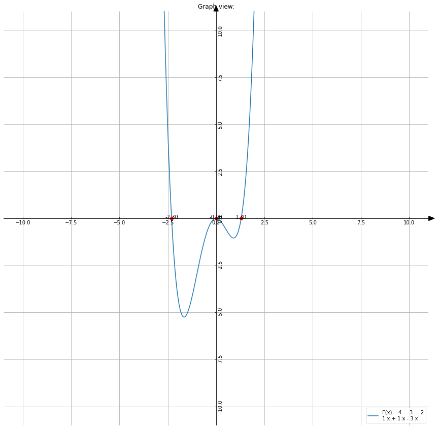

<h1> Bisection Method </h1>

**Dependencies:**

	Requires python version >= 3.6.
	Requires numpy, sympy.
	Optional : matplotlib & jupyter server.

- `pip install numpy`
- `pip install sympy`
- `pip install matplotlib`

**External axes class:**

	Used to display coertisan grid.

**How to Use:**

	1.Enter the polynomial virtue.
	2.Enter the coefficient for each of the variables in the polynomial.
	3.Enter a starting point and an ending point (inspection range).
	4.The program will compute the polynomial using bisection method.
	5.Result will be presented as output and graphically.
	   * Graph will be saved in ./images
	   * Output will display both roots from function and derived function.

	If you have jupyter server you can view the graph after running the code.
	On the top and bottom of the bisection.py file you can click run Above/Below next to the #%% signs.

**Output example:**
	Function of virtue 4

		 4     3     2
	1 x + 1 x - 3 x

	Inspection Range: [-3.0,2.0]

	x0 = -2.303
	x1 = 1.303
	x2 = -0.000 (from derived function)
	Inspection Range: [-3.0,2.0]

